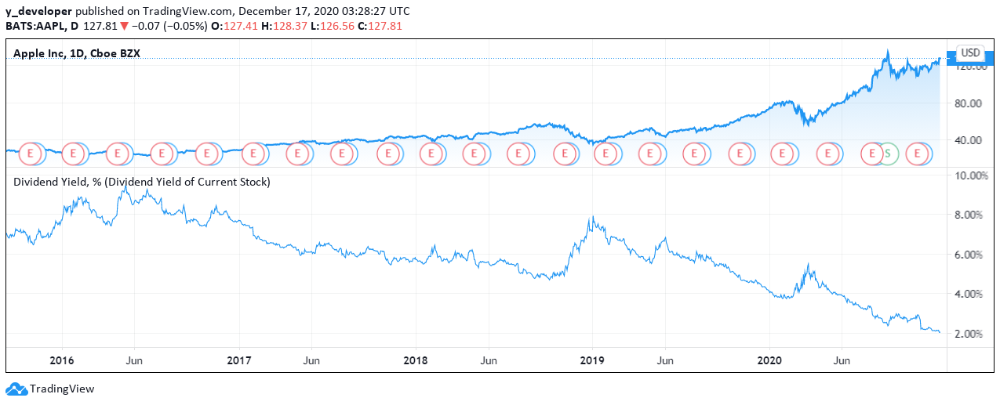

# Dividend-Yield

## 1. What is the Dividend Yield?

The dividend yield, expressed as a percentage, is a financial ratio 

It shows how much a company pays out in dividends each year relative to its stock price.

Today, we are going to introduce how to use the dividend yield of S&P 500 as an indicator of the market performance


## 2. What does the spread tell you?

The dividend yield is an estimate of the dividend-only return of a stock investment. 

Assuming the dividend is not raised or lowered, the yield will rise when the price of the stock falls. 

And conversely, it will fall when the price of the stock rises. 

Because dividend yields change relative to the stock price, it can often look unusually high for stocks that are falling in value quickly.

## 3. Tradingview Pine Script

### · Step One: Initial Setting

```
//@version=4
study("SPY Dividend Yield", precision=5,overlay = false)
```
(1) Since we are not using the dividend yield as a tool for our stock trading, we start with the study function instead of strategy

(2) With study function, we have fewer parameters to set up

(3) Here, we only set two parameters, one is precision and the other is overlay

(4) We set overlay to be false to place the dividend yield graph on a seperate window

### · Step Two: Parameter Setting

```
// the 'close' is the amount of the dividend
dividendsValue = security('ESD_FACTSET:AMEX;SPY' + ";DIVIDENDS", "D", close, lookahead=true)

//yearly dividend = sum of four dividends in the past 4 quarters
yr_div = dividendsValue[0] + dividendsValue[64] + dividendsValue[127] + dividendsValue[190]

div_ratio = (yr_div / close)*100
```
(1) We first locate all S&P 500 dividends through the years

(2) The first line will give us all historical dividends that SPY has paid out

(3) On TradingView, the value of dividends on dates that the stock didn’t pay a dividend will be the last dividend paid.

(4) For example, one stock pays a 1 dollar dividend a week ago and nothing since then.

(5) If I look at stock’s dividend of today, it will also have the value of 1 dollar until the next dividend is paid out.

(6) Because SPY is an ETF that pays out dividends regularly on the last day of each quarter, we can easily calculate the yearly dividend we receive by adding up the dividend value of today, the value of 64 days ago, the value of 127 days ago, and 190 days ago

(7) Why the numbers here are not 0, 90, 180 and 270 days ago? Because TradingView only records prices and dividends on trading days, and there are only 252 trading days each year after deducting holidays and weekends

(8) So we must be careful when choosing the correct dates.

(9) Here, the variable yr-slash-div will give us the annual dividend of SPY on any single date.

(10) Finally, we calculate the dividend yield by dividing the annual dividend by the day’s closing price and times 100 to get a percentage

(11) That’s how we calculate the dividend yield with the most intuitive way

### · Step Three: Plotting

```
plot(div_ratio)
```
(1) With an easy command, we plot out the dividend yield we just calculated. The curve looks like the following:



