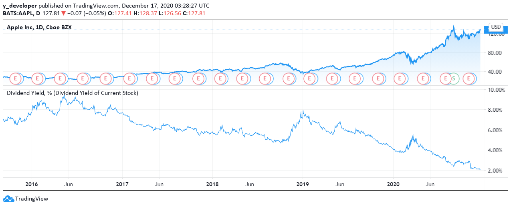
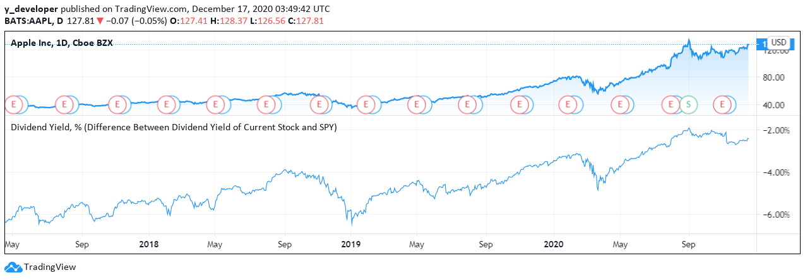

# Dividend-Yield

## 1. What is the Dividend Yield?

The dividend yield, expressed as a percentage, is a financial ratio 

It shows how much a company pays out in dividends each year relative to its stock price.

Today, we are going to introduce how to use the dividend yield as an indicator of the market performance


## 2. What does the spread tell you?

The dividend yield is an estimate of the dividend-only return of a stock investment. 

Assuming the dividend is not raised or lowered, the yield will rise when the price of the stock falls. 

And conversely, it will fall when the price of the stock rises. 

Because dividend yields change relative to the stock price, it can often look unusually high for stocks that are falling in value quickly.

## 3. Tradingview Pine Script

### · Step One: Initial Setting

```
//@version=4
// Step One:Initial Setting
study(title="Yaonology Dividend Yield Tutorial", shorttitle="Dividend Yield, %", format=format.percent, precision=2, overlay=false)
```
(1) Since we are not using the dividend yield as a tool for our stock trading, we start with the study function instead of strategy

(2) With study function, we have fewer parameters to set up

(3) Here, we only set three parameters, format, precision and overlay

(4) We set overlay to be false to place the dividend yield graph on a seperate window

### · Step Two: Parameter Setting

```
// Step Two:Parameter Setting 
dwm_period = timeframe.isdwm ? timeframe.period : "D"
day_time = 24*60*60*1000

// Subtract slightly less than one month to accomodate possible overlaps in dividends
year_ago_time = time - (366-27)*day_time
year_sum(s) => 
    i = time[1] < year_ago_time ? 1 :
         nz(time[2]) < year_ago_time ? 2 :
         nz(time[3]) < year_ago_time ? 3 :
         nz(time[4]) < year_ago_time ? 4 :
         nz(time[5]) < year_ago_time ? 5 :
         nz(time[6]) < year_ago_time ? 6 :
         nz(time[7]) < year_ago_time ? 7 :
         nz(time[8]) < year_ago_time ? 8 :
         nz(time[9]) < year_ago_time ? 9 :
         nz(time[10]) < year_ago_time ? 10 :
         nz(time[11]) < year_ago_time ? 11 :
         nz(time[12]) < year_ago_time ? 12 : 13
    csum = cum(close)
    csum - nz(csum[i])
div_ticker = tickerid("ESD", syminfo.prefix + ";" + syminfo.ticker +";" +"DIVIDENDS")
div_ttm = security(div_ticker, dwm_period, year_sum(close), true, lookahead=true)
div_ttm_fill = security(div_ticker, dwm_period, year_sum(close), false, lookahead=true)

div_ticker_spy = 'ESD_FACTSET:AMEX;SPY'+";" +"DIVIDENDS"
div_ttm_spy = security(div_ticker_spy, dwm_period, year_sum(close), true, lookahead=true)
div_ttm_fill_spy = security(div_ticker_spy, dwm_period, year_sum(close), false, lookahead=true)

// Add gaps for cases when there is no dividends in last year. +1 month to avoid few-day gaps.
float last_div_ttm_time = na
last_div_ttm_time := na(div_ttm) ? last_div_ttm_time[1] : time
div_ttm_fill_with_gaps = last_div_ttm_time < time-(366+27)*day_time ? na : div_ttm_fill

float last_div_ttm_time_spy = na
last_div_ttm_time_spy := na(div_ttm_spy) ? last_div_ttm_time_spy[1] : time
div_ttm_fill_with_gaps_spy = last_div_ttm_time_spy < time-(366+27)*day_time ? na : div_ttm_fill_spy

float div_ratio = div_ttm_fill_with_gaps / close * 100
float div_ratio_spy = div_ttm_fill_with_gaps_spy / close * 100
float div_ratio_diff = div_ratio - div_ratio_spy
```
(1) We first locate all dividends through the years

(2) The div_ttm_fill will give us all historical dividends that current stock has paid out

(3) On TradingView, the value of dividends on dates that the stock didn’t pay a dividend will be the last dividend paid.

(4) For example, one stock pays a 1 dollar dividend a week ago and nothing since then.

(5) If I look at stock’s dividend of today, it will also have the value of 1 dollar until the next dividend is paid out.

(6) We can then calculate the yearly dividend we receive by adding up the dividend value giving out in the past year

(7) Here, the variable div_ttm_fill_with_gaps will give us the annual dividend of current stock on any single date.

(8) The variable div_ttm_fill_with_gaps_spy will give us the annual dividend of SPY on any single date.

(9) Finally, we calculate the dividend yield (div_ratio) by dividing the annual dividend by the day’s closing price and times 100 to get a percentage

(10) We calculate the dividend yield of SPY (div_ratio_spy) by dividing the annual dividend of spy by the day’s spy closing price and times 100 to get a percentage

(11) That’s how we calculate the dividend yield and dividend yield of SPY

### · Step Three: Plotting

```
// Step Three:Plotting
// Choose which plot to show, the dividend yield or the difference between dividend yield of current stock and SPY
choice = input(title="Choice", defval="Dividend Yield of Current Stock", options=["Dividend Yield of Current Stock", "Difference Between Dividend Yield of Current Stock and SPY"]) 

plot(choice == "Dividend Yield of Current Stock" ? div_ratio : choice == "Difference Between Dividend Yield of Current Stock and SPY" ? div_ratio_diff : na)
```
(1) Then, we need to plot what we have got

(2) First we need to choose which plot we want, the dividend yield or the difference between dividend yield of current stock and SPY

(3) Then with a simple command, we can get the plot we want



(4) If you want to change the plot to the difference between dividend yield of current stock and SPY, simply click on the setting button on the plot and select "Difference Between Dividend Yield of Current Stock and SPY"



